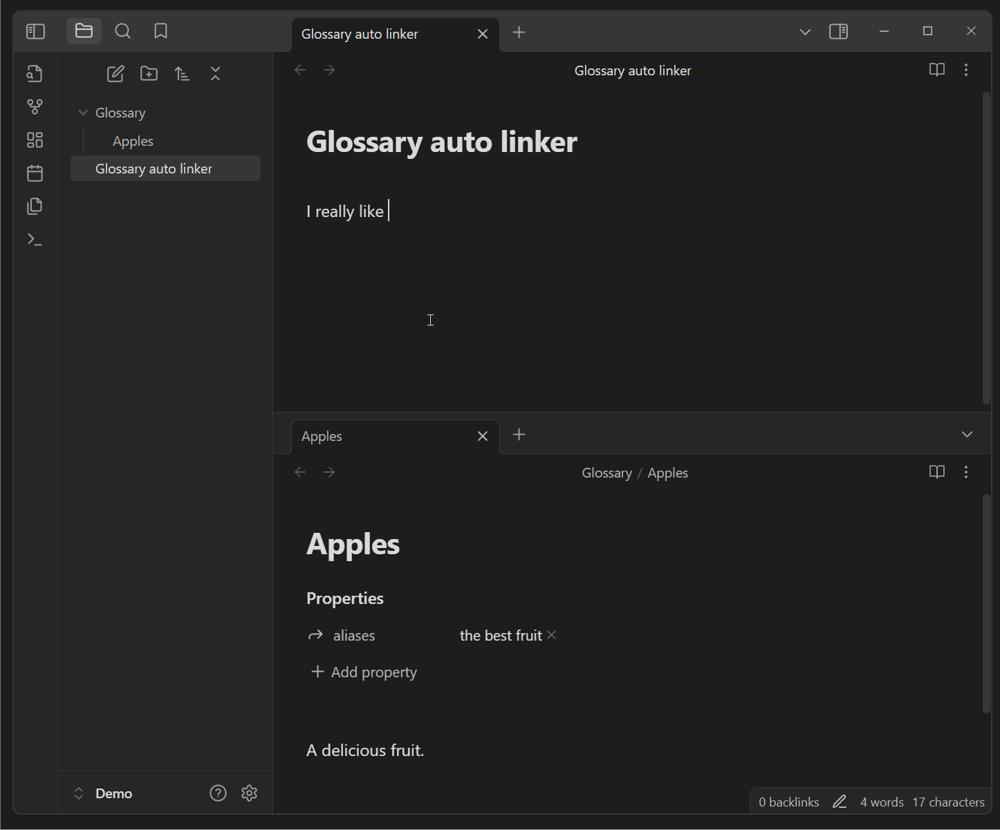

# Obsidian Virtual Linker Plugin (Glossary Plugin)

This plugin automatically generates virtual links for text within your notes that match with the titles or aliases of other notes in your vault.

Features:
- create a glossary like functionality
- works in **edit mode** and **read mode**
- created links are **always up to date** 
- **no manual linking** necessary 
- works with **aliases** of notes
- links do not appear in graph view & reference counting
- updates the links automatically while you expand your vault or type new text
- convert the virtual links to real links in the context menu

Usage demo (literally just typing text ;-):


## Usage

By default, the plugin will automatically link all notes of your vault.
All occurrences of a note title or alias will be linked in your current note text.
If you only want to include notes of a specific folder, you can define this folder in the settings.

> [!Note]
> The auto generated links are post-processed, so they neither change your note text to hard-coded links enclosed in brackets not 
> appear in the graph view or reference counting.


## Manually installing the plugin

- Copy over `main.js` & `manifest.json` (find them under `Releases`) to your vault `VaultFolder/.obsidian/plugins/virtual-linker/`.

## Styling of the links

The links are styled with the class `virtual-link`. 
You can style them by adding a CSS-snippet at `VaultFolder/.obsidian/snippets/virtualLinks.css` file.

```css
.virtual-link {
    /* E.g. to change the color of all links to red */
    color: red !important;

    /* E.g. to show the links in the same color as your normal links but a little bit darker */
    color: var(--link-color) !important;
    filter: brightness(0.6);
}

```

## How to use for development

- Clone this repo (into `your-vault/.obsidian/plugins/`).
- `yarn` to install dependencies
- `yarn dev` to start compilation in watch mode.
- `yarn build` to compile your `main.ts` into `main.js`.

It is recommended to use the [Hot Reload Plugin](https://github.com/pjeby/hot-reload) for development.
